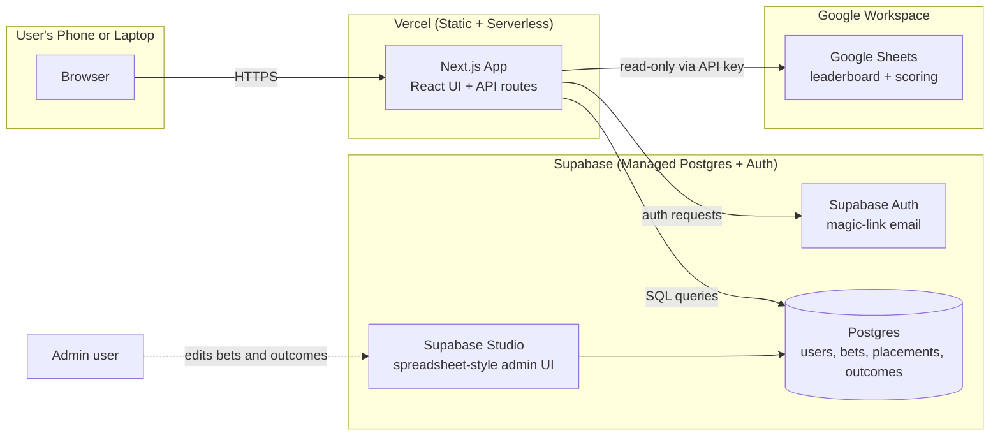
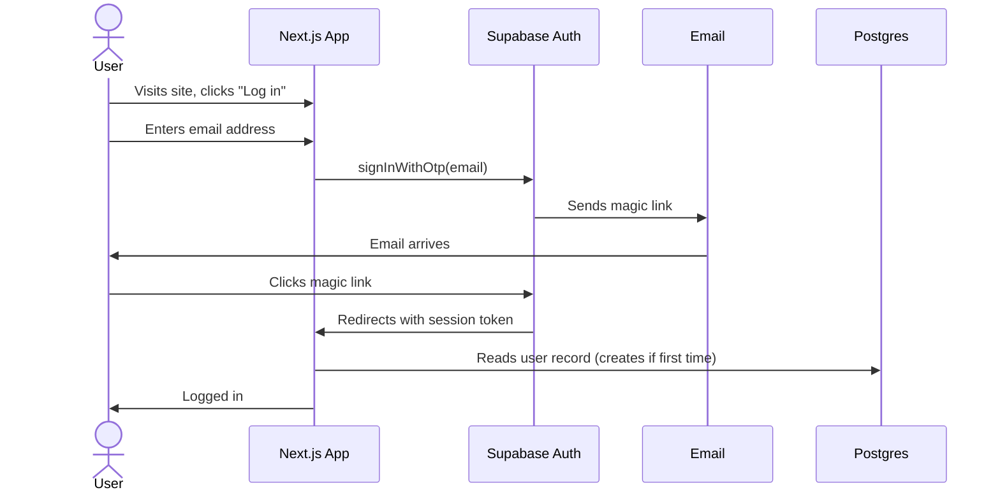

# Architecture

How the pieces fit together, and why these specific pieces were chosen.

---

## 1. The Big Picture

**Three flows, three responsibilities:**

1. **Read odds** — Browser asks Next.js for the active bet menu → Next.js queries Postgres → response rendered.
2. **Write bets** — Browser sends bet placement to Next.js API route → Next.js validates constraints → Postgres insert/update → confirmation back to browser.
3. **Read leaderboard** — Browser asks Next.js for tournament standings → Next.js fetches from Google Sheets API → response rendered.

The "CMS" is not a separate system. **The CMS is Supabase Studio**, which is the admin dashboard that ships with every Supabase project. It looks like a spreadsheet, but it edits the actual Postgres database underneath. Pat, Jake, Steve, and Andrew log in and edit rows directly.

---

## 2. Technology Choices and Rationale

### 2.1 Next.js (frontend framework)

**Choice:** Next.js 14+ with the App Router, written in TypeScript.

**Why:**
- The most-trained framework in modern AI coding tools — vibe-coding produces dramatically better results here than with Astro, SvelteKit, Remix, or vanilla React.
- Server components let us query Supabase directly from the page render without writing a separate API layer for read traffic.
- API routes (in `app/api/`) handle bet submission with server-side constraint validation.
- Vercel hosting is built around Next.js — deployment is one click.

**Alternative considered: Astro.** Better for content-heavy sites, but bet submission needs interactive forms with server-side validation, and Astro adds complexity for that pattern.

### 2.2 Supabase (database + auth + admin UI)

**Choice:** Supabase, hosted (free tier).

**Why:**
- **Real Postgres**, not a wrapper. ACID guarantees matter when 10 people submit bets simultaneously.
- **Built-in authentication** — magic-link email is one config setting. No password storage, no password resets.
- **Supabase Studio is the CMS.** This is the killer feature. Admins edit bets and outcomes in a grid view that looks like Excel. No separate CMS to integrate.
- **Row-Level Security (RLS)** policies enforce who can see what at the database layer — even if there's a bug in the app code, a participant can't see admin-only data.
- **Free tier:** 500MB database, 50K monthly active users, unlimited API requests. We will not come close to these limits.

**Alternative considered: DigitalOcean Managed Postgres + custom auth + custom admin UI.** Steve works at DO and could provision this, but we'd need to build authentication and an admin UI from scratch — easily several weekends of work that Supabase gives us for free. Steve's expertise is better deployed for code review and incident response. Save the DO option for if/when Supabase free tier becomes insufficient (it won't, for 24 users).

**Alternative considered: Firebase.** Works, but the NoSQL document model is a poor fit for relational bet data, and AI tools currently produce better Supabase code than Firebase code.

### 2.3 Vercel (hosting)

**Choice:** Vercel free tier ("Hobby").

**Why:**
- Built by the makers of Next.js; zero configuration needed.
- Auto-deploys every push to `main`. No CI/CD pipelines to maintain.
- Free tier: 100GB bandwidth/month. We will use a fraction of this.
- Custom domain support (if you buy `ozarkopen.bet` or similar, it's a 30-second DNS change).

**Alternative considered: DigitalOcean App Platform.** Functionally equivalent and Steve could help. Slightly more configuration; not Next.js-native. Vercel wins on simplicity.

### 2.4 Google Sheets (leaderboard data source, read-only)

**Choice:** The existing Excel workbook gets mirrored into a Google Sheet. The app reads from the Sheet via the Google Sheets API.

**Why:**
- Pat already maintains the workbook and trusts the math in it. We don't want to migrate that logic.
- Google Sheets API is well-documented and free at this scale.
- Read-only access via a service account: simple, safe, no risk of the app corrupting the workbook.

**Why not use Google Sheets as the bets database too?** Concurrent writes to a Sheet corrupt rows in confusing ways. There are no transactions, no constraints, no real querying. For a system where 8+ people might submit bets within the same minute, this is a real risk. **Sheets for read, Postgres for write.**

---

## 3. Authentication Flow

**Implementation notes:**
- First time a new email logs in, Supabase auto-creates an `auth.users` row. We sync this to our `public.users` table via a database trigger.
- New users default to `is_admin = false`. To promote someone to admin, edit the `is_admin` column in Supabase Studio.
- Sessions persist via HTTP-only cookies (handled by Supabase client SDK).
- No password reset flow needed — there are no passwords.

---

## 4. Authorization (Row-Level Security)

We enforce permissions at the database layer using Postgres Row-Level Security policies, not just in the app code. This is defense-in-depth — even if a bug in the UI accidentally exposes an admin endpoint, the database refuses to return data the user shouldn't see.

**Two roles:** `participant` (default) and `admin` (`is_admin = true`).

**Key policies:**
- Anyone authenticated can read `bets` where `status` is `open`, `closed`, or `resolved` (not `draft`).
- Authenticated users can insert / update / delete their own rows in `bet_placements`. They cannot touch anyone else's.
- Only admins can insert / update rows in `bets`, `bet_categories`, `tournaments`.
- Only admins can read `bet_placements` from other users while `status = open` (prevents herd behavior).

Full policy definitions live inline in each table's migration file under `supabase/migrations/`.

---

## 5. Where the Math Lives

Two pieces of math, two different homes:

### 5.1 Constraint validation (at submission time)

Lives in: `lib/validation.ts` — invoked by the placement API route in `app/api/placements/route.ts`.

Why server-side: a malicious user could bypass client-side checks. The validation runs on Vercel before any database write.

### 5.2 Theoretical and actual payout calculation

Lives in: a Postgres view (`payouts_view`) plus a small TypeScript helper in `lib/payouts.ts` for the per-user roll-up.

Why a view: the payout for any user is fully determined by their placements and the resolved bet outcomes. A view keeps it always-fresh and avoids stale cached values. The actual-payout proportional split runs in TypeScript at render time because it requires summing across all users (a single query result, not a per-row computation).

---

## 6. What Lives Where (Summary)

| Concern | Location |
|---|---|
| User accounts and auth | Supabase Auth (`auth.users`) + `public.users` mirror |
| Bets (the menu) | Postgres `bets` table |
| Bet outcomes | Postgres `bets.outcome` column |
| Individual placements | Postgres `bet_placements` table |
| Constraint validation | `lib/validation.ts` (Next.js server) |
| Theoretical payout | Postgres view (`payouts_view`) |
| Actual payout split | TypeScript at render time (`lib/payouts.ts`) |
| Admin "CMS" | Supabase Studio (web UI bundled with Supabase) |
| Tournament leaderboard | Google Sheets (existing workbook), read via API |
| Tournament scoring math | Excel workbook → Google Sheets mirror (unchanged) |
| Hosting | Vercel |

---

## 7. What's Explicitly NOT in the Architecture

- **A separate backend server.** Next.js API routes on Vercel are sufficient.
- **A queue or background job system.** All work is request/response; there are no async jobs.
- **A separate CMS (Sanity, Contentful, etc.).** Supabase Studio is the CMS.
- **Caching layer.** Postgres handles 24 users without breaking a sweat. If we ever need it, Vercel has built-in Edge caching.
- **Custom email server.** Supabase Auth sends magic-link emails for free.
- **CI/CD pipeline.** Vercel rebuilds and deploys on every `git push`.
