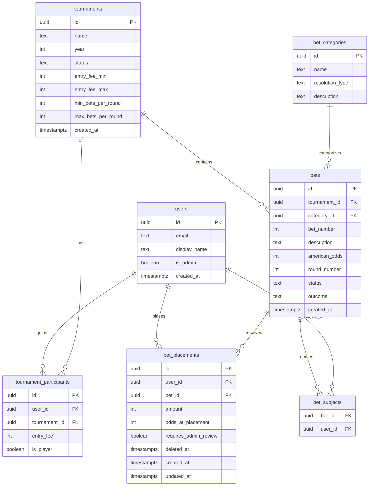

# Data Model

The database schema for the Ozark Open Sportsbook. This is the most important file in the repo — get this right and the rest of the app falls into place. Get it wrong and you'll be rewriting code for years.

---

## 1. Design Principles

1. **Generic bets, not hardcoded ones.** The seven bet categories from the original Sportsbook are stored as data, not code. Adding a new category requires inserting a row into `bet_categories`, not editing source files. *(Pat has proposed a category/subcategory/`group_id` restructure — see §3.5 "Proposed" note and PRD §6.1; it is pending a design meeting and not yet reflected in the live schema.)*
2. **Evergreen identity.** A user has one record forever. Tournaments are separate entities. A user joins a tournament via a join table.
3. **Outcomes attach to bets, not placements.** A bet hits or misses once, globally. We don't store hit/miss per-placement.
4. **Theoretical payout is computed, never stored.** It's a function of `placement.amount`, `placement.odds_at_placement`, and `bet.outcome`. A Postgres view derives it on demand. (Odds are snapshotted onto the placement at write time — see §3.7 and PRD §7.1.) **Voids are a special case:** a voided bet contributes nothing to the theoretical total, its stake is refunded, and those dollars leave the pool (PRD §5, Q6) — see §4.
5. **Constraints in the right place.** Schema enforces things that are always true (a placement must have positive amount). App code enforces things that are contextual (you can't have more than 10 placements across the tournament).

---

## 2. Schema Overview



---

## 3. Table Definitions

### 3.1 `users`

One row per person who ever logs in. Persists across tournaments forever.

| Column | Type | Notes |
|---|---|---|
| `id` | `uuid` PK | Matches `auth.users.id` from Supabase Auth |
| `email` | `text` UNIQUE NOT NULL | Used for magic-link login |
| `display_name` | `text` NOT NULL | E.g. "Dan Mercer" — what shows on bets. **User sets it at registration; immutable by the user thereafter. Admins can always edit it** and keep it matching the official tournament roster, since self-bet flagging relies on the name match (PRD §12 Q13). |
| `is_admin` | `boolean` NOT NULL DEFAULT `false` | Admins are Pat, Jake, Steve, Andrew |
| `created_at` | `timestamptz` NOT NULL DEFAULT `now()` | |

**Why no `password` column:** there are no passwords. Authentication is magic-link only via Supabase Auth.

**Why no `venmo_handle` column:** the app does not handle payment. Pat keeps Venmo info in his phone, as today.

---

### 3.2 `tournaments`

One row per Ozark Open year. Holds the rule parameters that govern that year's pool.

| Column | Type | Notes |
|---|---|---|
| `id` | `uuid` PK | |
| `name` | `text` NOT NULL | E.g. "Ozark Open 2026" |
| `year` | `int` NOT NULL UNIQUE | E.g. 2026 |
| `status` | `text` NOT NULL CHECK IN (`'upcoming'`, `'active'`, `'completed'`) | Controls visibility |
| `entry_fee_min` | `int` NOT NULL DEFAULT 20 | Lower bound on entry |
| `entry_fee_max` | `int` NOT NULL DEFAULT 50 | Upper bound on entry |
| `min_bets_per_round` | `int` NOT NULL DEFAULT 5 | **Misnamed — semantics are now per *tournament*, not per round** (Pat, Q2: the 5–10 count spans both rounds combined). Rename to `min_bets_per_tournament` in the Sprint 1 migration. |
| `max_bets_per_round` | `int` NOT NULL DEFAULT 10 | Likewise → `max_bets_per_tournament`. Counts across both rounds, not each round. |
| `max_single_bet_pct` | `numeric(3,2)` NOT NULL DEFAULT 0.50 | Half of entry, by default |
| `max_single_bet_cap` | `int` NOT NULL DEFAULT 20 | Hard cap regardless of entry size |
| `max_self_bet_pct` | `numeric(3,2)` NOT NULL DEFAULT 0.25 | Quarter of entry |
| `max_self_bet_cap` | `int` NOT NULL DEFAULT 10 | Hard cap on self-bets |
| `created_at` | `timestamptz` NOT NULL DEFAULT `now()` | |

**Why store rule parameters per-tournament:** the original memo's rules might evolve. Storing them on the tournament row means the 2026 rules are preserved exactly even if 2027 changes them.

---

### 3.3 `tournament_participants`

Join table connecting users to tournaments. A user is "in" a tournament for a given year if a row exists here.

| Column | Type | Notes |
|---|---|---|
| `id` | `uuid` PK | |
| `user_id` | `uuid` NOT NULL FK → `users.id` | |
| `tournament_id` | `uuid` NOT NULL FK → `tournaments.id` | |
| `entry_fee` | `int` NOT NULL CHECK (`entry_fee BETWEEN 20 AND 50`) | The participant's chosen entry, $20–$50 |
| `is_player` | `boolean` NOT NULL DEFAULT `true` | True if they're playing golf, false if they're only betting |
| `betting_enabled` | `boolean` NOT NULL DEFAULT `true` | **Proposed (Sprint 1).** Admin toggle to enable/disable betting for any user, playing or not (PRD §12 Q14). |

**Constraint:** UNIQUE (`user_id`, `tournament_id`) — a user can only join a tournament once.

**Why `is_player`:** the rules talk about "betting on yourself" — that only matters if the bettor is also a player. **Non-playing entrants are exempt from the self-bet rule and carry a stricter betting maximum** than players (the exact stricter cap is still open — see `OUTSTANDING_DECISIONS.md` #2; it will be a per-tournament param or a per-participant override once decided). Expect 0–5 non-players; the app supports any number (Q14).

---

### 3.4 `bet_categories`

The seven categories from the original Sportsbook, stored as configurable data.

| Column | Type | Notes |
|---|---|---|
| `id` | `uuid` PK | |
| `name` | `text` NOT NULL UNIQUE | E.g. "Top 4 Finish + Ties" |
| `resolution_type` | `text` NOT NULL | Enum: `'single_winner'`, `'top_n_with_ties'`, `'head_to_head_strict'`, `'best_in_group_with_ties'`, `'head_to_head_void_on_tie'`, `'best_in_group_strict'`, `'prop'` |
| `description` | `text` | Human-readable explanation |

**Seed data** (loaded by the initial migration): the seven categories listed in PRD §6.

**Adding an eighth category later:** insert a row here. If the new `resolution_type` requires custom outcome logic, add a small case to `lib/payouts.ts` and ship it. This is the one piece that requires a code change, by design — payout math is too important to leave to runtime configuration.

---

### 3.5 `bets`

The bet menu. One row per bet number (#1, #2, …) per tournament.

| Column | Type | Notes |
|---|---|---|
| `id` | `uuid` PK | |
| `tournament_id` | `uuid` NOT NULL FK → `tournaments.id` | |
| `category_id` | `uuid` NOT NULL FK → `bet_categories.id` | |
| `bet_number` | `int` NOT NULL | Friendly identifier — the "#3" in "$3 on #3" |
| `description` | `text` NOT NULL | E.g. "Dan Mercer to win tournament" |
| `american_odds` | `int` NOT NULL | Positive or negative (e.g., `+150`, `-130`). Zero is invalid. |
| `round_number` | `int` NOT NULL CHECK IN (1, 2) | Betting Round 1 (resolves after Day 1, Thursday) or Round 2 (resolves after Day 3, Saturday). Day 2 (Friday scramble) is **not** covered by the Sportsbook (Q9). *(Pat's §6.1 proposal would rename these to golf "Round 1" / "Round 3" — pending the design meeting.)* |
| `status` | `text` NOT NULL CHECK IN (`'draft'`, `'open'`, `'closed'`, `'resolved'`) DEFAULT `'draft'` | |
| `outcome` | `text` CHECK IN (`'hit'`, `'miss'`, `'push'`, `'void'`) | NULL until status = resolved |
| `created_at` | `timestamptz` NOT NULL DEFAULT `now()` | |

**Constraint:** UNIQUE (`tournament_id`, `bet_number`) — bet numbers don't repeat within a tournament.

**Constraint (added in Sprint 1):** CHECK `(status = 'resolved') = (outcome IS NOT NULL)` — a bet is resolved if and only if it has an outcome. Admins edit these columns directly in Studio; the database refuses the two plausible fat-fingers (outcome on an open bet, resolved with no outcome).

**Why no `fractional_odds` column:** computed from `american_odds` at render time. Single source of truth.

**Why no `implied_probability` column:** also computed from `american_odds`. Single source of truth.

**Proposed schema changes (pending the §6.1 design meeting — do not build yet):** Pat's restructure (PRD §6.1) would add a **top-level category** (Final Tournament / Round 1 / Round 3), a **`subcategory`** (Winner-Top-Finisher / Top-X / Head-to-Head-2 / Head-to-Head-3+ / Prop), and a **`group_id`** (so a subcategory can hold multiple independent groups, e.g. several head-to-head matchups) to each bet, alongside the existing `bet_number`/`bet_id`. The per-subcategory selection rules (multi-select for winner/top-X; single-player for head-to-heads; one-per-group for props) would move into `lib/validation.ts`. This is recorded for the meeting only; the live table above and the seven `resolution_type` values are unchanged until it's finalized. See `OUTSTANDING_DECISIONS.md` #1.

---

### 3.6 `bet_subjects`

Which players a bet is "about." Used for self-bet detection. A bet can name zero, one, or many players.

| Column | Type | Notes |
|---|---|---|
| `bet_id` | `uuid` NOT NULL FK → `bets.id` | |
| `user_id` | `uuid` NOT NULL FK → `users.id` | The player named in the bet |

**Constraint:** PRIMARY KEY (`bet_id`, `user_id`).

**Examples:**
- "Dan Mercer to win" → one row: (bet_id, Dan Mercer's user_id)
- "Best Finisher among Jake Kohne / Steve Jones / Mike Yenzer" → three rows
- "Most even-numbered scores" (a prop bet) → zero rows; not about any specific player

**Self-bet detection** at submission time: if `user_id` of the placement matches any `user_id` in `bet_subjects` for that bet, flag for admin review.

---

### 3.7 `bet_placements`

Each individual wager: one row per (user, bet) pair where money was placed.

| Column | Type | Notes |
|---|---|---|
| `id` | `uuid` PK | |
| `user_id` | `uuid` NOT NULL FK → `users.id` | The bettor |
| `bet_id` | `uuid` NOT NULL FK → `bets.id` | The bet being placed |
| `amount` | `int` NOT NULL CHECK (`amount > 0`) | Whole dollars, $1 minimum |
| `odds_at_placement` | `int` NOT NULL | Snapshot of `bets.american_odds` at write time. **Payouts compute from this, never from the live bet row** — admins can reprice an open bet without silently changing existing bettors' payouts (PRD §7.1). Added in Sprint 1. |
| `requires_admin_review` | `boolean` NOT NULL DEFAULT `false` | Set on write when the bettor appears in `bet_subjects` for the bet (self-bet flag, PRD §7). Added in Sprint 1. |
| `deleted_at` | `timestamptz` | Soft delete — removing a placement sets this instead of deleting the row. Money data keeps its history for dispute resolution. All reads filter `deleted_at IS NULL`. Added in Sprint 1. |
| `created_at` | `timestamptz` NOT NULL DEFAULT `now()` | |
| `updated_at` | `timestamptz` NOT NULL DEFAULT `now()` | Updated on edit |

**Constraint:** UNIQUE (`user_id`, `bet_id`) — a user can only have one placement per bet. (Editing the placement updates `amount` rather than creating a second row. Re-placing after a soft delete revives the existing row — clears `deleted_at`, updates `amount`, and re-snapshots `odds_at_placement` — so the unique constraint holds.)

**Constraints NOT enforced at the schema level** (these live in app code because they require cross-row checks; semantics per PRD §7/§12):
- Between 5 and 10 placements per user **across the tournament (both rounds combined)** — not per round (Q2, revised by Pat). A participant may place all of them in one round.
- Sum of placements **across both rounds** ≤ entry fee; must equal it exactly by Round 2 close ("$40 across the board" — the entry fee funds the whole tournament, not each round).
- Single placement amount ≤ `min(max_single_bet_pct × entry_fee, max_single_bet_cap)` — per placement, either round.
- Sum of self-bet placements **across the tournament** ≤ `min(max_self_bet_pct × entry_fee, max_self_bet_cap)`.
- Non-playing bettors carry a **stricter single/self max** than players (value TBD — `OUTSTANDING_DECISIONS.md` #2).
- Per-subcategory selection limits once the §6.1 taxonomy lands (one player per head-to-head; one bet per prop group).

---

## 4. The Payout View

A read-only Postgres view that computes each placement's theoretical payout. Defined in a migration; queryable like a table.

```sql
CREATE VIEW placement_payouts_view AS
SELECT
    p.id                 AS placement_id,
    p.user_id,
    p.bet_id,
    p.amount,
    b.outcome,
    p.odds_at_placement,
    b.tournament_id,
    CASE
        WHEN b.outcome = 'hit' AND p.odds_at_placement > 0
            THEN p.amount + (p.amount * p.odds_at_placement / 100.0)
        WHEN b.outcome = 'hit' AND p.odds_at_placement < 0
            THEN p.amount + (p.amount * 100.0 / ABS(p.odds_at_placement))
        WHEN b.outcome = 'push'
            THEN p.amount            -- push counts; stake returned as its payout
        WHEN b.outcome = 'miss'
            THEN 0
        WHEN b.outcome = 'void'
            THEN 0                   -- void does NOT count toward the theoretical total
        ELSE NULL                    -- bet not yet resolved
    END AS theoretical_payout,
    CASE WHEN b.outcome = 'void' THEN p.amount ELSE 0 END AS refund
FROM bet_placements p
JOIN bets b ON b.id = p.bet_id
WHERE p.deleted_at IS NULL;
```

**Push vs void** *(revised by Pat, Jul 2026 — Q6)*: a **push** counts, contributing its stake as `theoretical_payout`. A **void** does **not** count — `theoretical_payout` is `0` and the stake surfaces in the new `refund` column instead. `lib/payouts.ts` then:

- **refunds** each void's stake to its bettor (paid back directly, off the top), and
- **reduces `pool_total`** by the sum of all refunds: `pool_total = Σ(entry_fee) − Σ(refund)`.

So voided dollars leave the pool entirely; they neither inflate the denominator nor earn a proportional share. *(This pool-math handling is inferred from Pat's stated principle and is money-critical — confirm before Sprint 6; `OUTSTANDING_DECISIONS.md` #3.)*

The view computes from `p.odds_at_placement` (the snapshot taken when the wager was written, PRD §7.1) — never from `b.american_odds`, which an admin may have repriced since — and excludes soft-deleted placements.

The actual-payout proportional split runs in TypeScript at render time, since it requires summing across all users (one query, then arithmetic) and now subtracting refunds from the pool.

---

## 5. Row-Level Security Highlights

Policies live inline in each table's migration file under `supabase/migrations/` (e.g., `20260507000000_users_table.sql`, `20260507000001_tournaments.sql`, `20260507000002_bets.sql`). Summary:

- **`bets`**: anyone authenticated can `SELECT` rows where `status != 'draft'`. Only admins can `INSERT` / `UPDATE` / `DELETE`.
- **`bet_placements`**: a user can `SELECT` / `INSERT` / `UPDATE` / `DELETE` their own rows. Other users' placements are visible only when the corresponding bet's status is `closed` or `resolved`. Admins can read all.
- **`tournament_participants`**: anyone authenticated can `SELECT`. Only admins can `INSERT` / `UPDATE`.
- **`bet_categories`, `tournaments`, `bets`, `bet_subjects`**: read by all authenticated users; write by admins only.
- **`users`**: a user can read their own row. Admins can read all.

---

## 6. Migration Strategy

- All schema changes are SQL files in `supabase/migrations/`, named with timestamps (`20260507000000_users_table.sql`).
- Apply locally with `npx supabase db push` or by pasting into the Supabase SQL Editor.
- Never edit the schema directly in Supabase Studio — only the data. Schema changes go through migration files so the production and local environments stay in sync.

**Migrations shipped so far** (one per phase, each with its tables + RLS + seeds):
- `20260507000000_users_table.sql` — `users`, `is_admin()` helper, new-user trigger
- `20260507000001_tournaments.sql` — `tournaments`, `tournament_participants`, 2026 seed
- `20260507000002_bets.sql` — `bet_categories`, `bets`, `bet_subjects`, seven-category seed

**Still to come** (see `ROADMAP.md`): `bet_placements` (Sprint 1), `placement_payouts_view` (Sprint 5).

**Known inconsistency to fix in the Sprint 1 migration:** `tournament_participants.entry_fee` currently has a hardcoded `CHECK (entry_fee BETWEEN 20 AND 50)`, but the entry-fee bounds are supposed to live on the `tournaments` row (`entry_fee_min` / `entry_fee_max`) per the "rules are data, not constants" convention. Fix: drop the hardcoded CHECK (keep `entry_fee > 0`) and enforce the per-tournament bounds in `lib/validation.ts` / at participant creation instead.
