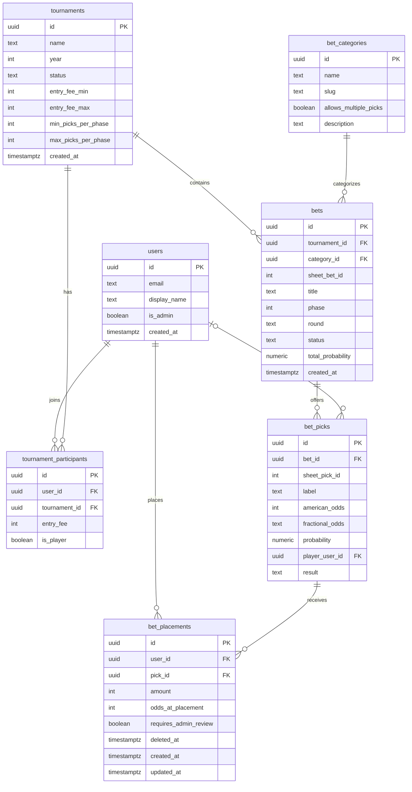

# Data Model

The database schema for the Ozark Open Sportsbook. This is the most important file in the repo — get this right and the rest of the app falls into place. Get it wrong and you'll be rewriting code for years.

---

## 1. Design Principles

1. **The spreadsheet is the source; the schema mirrors it.** Bets, picks, odds, statuses, and results all arrive from the admin's spreadsheet (ADR 0001) and are upserted by its stable IDs. The app never adjudicates a bet — there is no resolution engine to model.
2. **Evergreen identity.** A user has one record forever. Tournaments are separate entities. A user joins a tournament via a join table.
3. **Results attach to picks, not bets or placements.** A pick hits or misses once, globally (`bet_picks.result`). We don't store hit/miss per-placement, and a bet has no outcome of its own — "resolved" is derived from its picks.
4. **Theoretical payout is computed, never stored.** It's a function of `placement.amount`, `placement.odds_at_placement`, and `pick.result`. A Postgres view derives it on demand. (Odds are snapshotted onto the placement at write time — see §3.7 and PRD §7.1.)
5. **Constraints in the right place.** Schema enforces things that are always true (a placement must have positive amount). App code enforces things that are contextual (you can't have more than 10 placements in a phase).

---

## 2. Schema Overview



---

## 3. Table Definitions

### 3.1 `users`

One row per person who ever logs in. Persists across tournaments forever.

| Column | Type | Notes |
|---|---|---|
| `id` | `uuid` PK | Matches `auth.users.id` from Supabase Auth |
| `email` | `text` UNIQUE NOT NULL | Used for magic-link login |
| `display_name` | `text` NOT NULL | E.g. "Dan Mercer" — what shows on bets and leaderboards. **Admin-set only** (Studio / import name-matching, ADR 0001 §11); never user-editable. |
| `nickname` | `text` NULL | Sprint 15 — a user-set *cosmetic* nickname shown next to `display_name` everywhere (a touch smaller, never a muted subtext). Null = none. Does **not** affect import name-matching. |
| `avatar_url` | `text` NULL | Sprint 15 — public URL of the user's uploaded avatar in the `avatars` storage bucket (`<uid>/avatar`, cache-busted). Null → a branded initials placeholder renders. |
| `is_admin` | `boolean` NOT NULL DEFAULT `false` | Admins are Pat, Jake, Steve, Andrew. Not user-editable (guard trigger). |
| `created_at` | `timestamptz` NOT NULL DEFAULT `now()` | |

**Why no `password` column:** there are no passwords. Authentication is magic-link only via Supabase Auth.

**Why no `venmo_handle` column:** the app does not handle payment. Pat keeps Venmo info in his phone, as today.

**Self-serve edits (Sprint 15).** An own-row `UPDATE` RLS policy (`auth.uid() = id`) lets a member update their own row, but a `BEFORE UPDATE` guard trigger (`guard_users_self_update`) pins `id`/`email`/`display_name`/`is_admin`/`created_at` for any logged-in non-admin — so `/profile` can change only `nickname` + `avatar_url`. Admins (import name-matching runs under an admin session) and Studio/service writes (`auth.uid()` is null) are unaffected. Avatars live in a public `avatars` storage bucket where a user may write only under their own `<uid>/` prefix (`20260719000000_user_profiles.sql`, `20260719000001_avatars_bucket.sql`).

---

### 3.2 `tournaments`

One row per Ozark Open year. Holds the rule parameters that govern that year's pool.

| Column | Type | Notes |
|---|---|---|
| `id` | `uuid` PK | |
| `name` | `text` NOT NULL | E.g. "Ozark Open 2026" |
| `year` | `int` NOT NULL UNIQUE | E.g. 2026 |
| `status` | `text` NOT NULL CHECK IN (`'upcoming'`, `'active'`, `'completed'`) | Controls visibility |
| `entry_fee_min` | `int` NOT NULL DEFAULT 20 | Lower bound on entry |
| `entry_fee_max` | `int` NOT NULL DEFAULT 50 | Upper bound on entry |
| `min_picks_per_phase` | `int` NOT NULL DEFAULT 5 | Renamed from `min_bets_per_round` (ADR 0001 §10) |
| `max_picks_per_phase` | `int` NOT NULL DEFAULT 10 | Renamed from `max_bets_per_round` |
| `max_single_bet_pct` | `numeric(3,2)` NOT NULL DEFAULT 0.50 | Half of entry, by default |
| `max_single_bet_cap` | `int` NOT NULL DEFAULT 20 | Hard cap regardless of entry size |
| `max_self_bet_pct` | `numeric(3,2)` NOT NULL DEFAULT 0.25 | Quarter of entry |
| `max_self_bet_cap` | `int` NOT NULL DEFAULT 10 | Hard cap on self-bets |
| `created_at` | `timestamptz` NOT NULL DEFAULT `now()` | |

**Why store rule parameters per-tournament:** the original memo's rules might evolve. Storing them on the tournament row means the 2026 rules are preserved exactly even if 2027 changes them.

---

### 3.3 `tournament_participants`

Join table connecting users to tournaments. A user is "in" a tournament for a given year if a row exists here.

| Column | Type | Notes |
|---|---|---|
| `id` | `uuid` PK | |
| `user_id` | `uuid` NOT NULL FK → `users.id` | |
| `tournament_id` | `uuid` NOT NULL FK → `tournaments.id` | |
| `entry_fee` | `int` NOT NULL CHECK (`entry_fee BETWEEN 20 AND 50`) | The participant's chosen entry, $20–$50 |
| `is_player` | `boolean` NOT NULL DEFAULT `true` | True if they're playing golf, false if they're only betting (rare) |

**Constraint:** UNIQUE (`user_id`, `tournament_id`) — a user can only join a tournament once.

**Why `is_player`:** the rules talk about "betting on yourself" — that only matters if the bettor is also a player. Non-playing entrants (if any) are exempt from the self-bet rule.

---

### 3.4 `bet_categories`

The five categories from ADR 0001 §2, stored as configurable data. Since the app never adjudicates (results arrive per pick from the sheet), a category carries only what the app actually uses: display info and the one wagering constraint that differs by category.

| Column | Type | Notes |
|---|---|---|
| `id` | `uuid` PK | |
| `name` | `text` NOT NULL UNIQUE | E.g. "Top X Finisher" — must match the sheet's `category` column |
| `slug` | `text` NOT NULL UNIQUE | E.g. `top_x_finisher` — stable key for code |
| `allows_multiple_picks` | `boolean` NOT NULL | `true` for Top Finisher / Top X Finisher / Prop Bet; `false` for Match / Group Match (one pick per participant, PRD §7 rule 7) |
| `description` | `text` | Human-readable explanation, incl. the informational tie rule (hit/push/manual) |

**Seed data** (re-seeded by the Sprint 1 rework migration): Top Finisher, Top X Finisher, Match, Group Match, Prop Bet.

**Why no `resolution_type`:** resolution math lives in the admin's Excel workbook (helper columns); the app ingests each pick's result and never computes one. Tie behavior is documented in `description` for humans, not consumed by code.

**Adding a sixth category later:** insert a row here and use its name in the sheet. If it needs a new wagering constraint beyond `allows_multiple_picks`, that's a code change — by design.

---

### 3.5 `bets`

The bet menu headings. One row per bet in the admin's spreadsheet, upserted by the sheet's `bet_id` (ADR 0001 §7).

| Column | Type | Notes |
|---|---|---|
| `id` | `uuid` PK | |
| `tournament_id` | `uuid` NOT NULL FK → `tournaments.id` | |
| `category_id` | `uuid` NOT NULL FK → `bet_categories.id` | Matched from the sheet's `category` column |
| `sheet_bet_id` | `int` NOT NULL | The sheet's `bet_id` — the stable upsert key. Not displayed. |
| `title` | `text` NOT NULL | The sheet's `bet` column, e.g. "Win Tournament". Not necessarily unique. |
| `phase` | `int` NOT NULL CHECK IN (1, 2) | Which betting window the bet belongs to |
| `round` | `text` NOT NULL CHECK IN (`'tournament'`, `'round_1'`, `'round_2'`, `'round_3'`) | Golf scope. `round_2` is allowed by schema but unused by policy — no Round 2 bets are released. |
| `status` | `text` NOT NULL CHECK IN (`'hidden'`, `'open'`, `'closed'`) DEFAULT `'hidden'` | `hidden` = placeholder, app ignores (the old "draft") |
| `total_probability` | `numeric` | Sum of pick probabilities, as calculated in the sheet. Displayed verbatim, informationally. |
| `created_at` | `timestamptz` NOT NULL DEFAULT `now()` | |

**Constraint:** UNIQUE (`tournament_id`, `sheet_bet_id`) — the upsert key.

**Why no `american_odds` / `outcome` here:** odds and results are per-**pick** now (§3.6). A bet has no outcome of its own; "resolved" is derived (bet `closed` + pick results non-pending). No stored resolved status means uploads can't desynchronize two representations — the fat-finger class the old `resolved ⇔ outcome` CHECK guarded against no longer exists.

---

### 3.6 `bet_picks`

The options within a bet — one row per pick in the spreadsheet, upserted by the sheet's `pick_id`. **This is what participants wager on.**

| Column | Type | Notes |
|---|---|---|
| `id` | `uuid` PK | |
| `bet_id` | `uuid` NOT NULL FK → `bets.id` ON DELETE CASCADE | |
| `sheet_pick_id` | `int` NOT NULL | The sheet's `pick_id` — the stable upsert key. Not displayed. |
| `label` | `text` NOT NULL | The sheet's `pick` column, incl. stroke notation: "Steve Jones (-5)", "Field", "Yes" |
| `american_odds` | `int` NOT NULL | E.g. `+400`, `-130`. Zero invalid. **Source of truth for payout math** (snapshotted at placement, PRD §7.1). |
| `fractional_odds` | `text` NOT NULL | As formatted in the sheet (e.g. "4/1"). Displayed verbatim — never recomputed. |
| `probability` | `numeric` NOT NULL | Implied probability as calculated in the sheet. Displayed verbatim to 1 decimal place. |
| `player_user_id` | `uuid` FK → `users.id` | The player this pick refers to, name-matched at import (stroke suffixes stripped). NULL for "Field", "Yes"/"No", and unmatched names (surfaced in the import report). Drives self-pick flagging and the opponent hard-block (PRD §7 rules 7–8). |
| `result` | `text` NOT NULL CHECK IN (`'pending'`, `'hit'`, `'miss'`, `'push'`, `'void'`) DEFAULT `'pending'` | From the sheet's `result` column. Displayed only when not `pending`. |

**Constraint:** UNIQUE (`bet_id`, `sheet_pick_id`). The sheet's `pick_id` is unique across the whole sheet; the importer verifies that before writing (the table can't express cross-bet uniqueness without denormalizing `tournament_id` — not worth it).

**Replaces `bet_subjects`** (dropped in the Sprint 1 rework migration): instead of a bet-level list of subject players, each pick links to its player. Self-pick = placing on a pick whose `player_user_id` is you. Opponent = you are a `player_user_id` of some pick in a Match/Group Match bet, and you place on a *different* pick of that bet.

---

### 3.7 `bet_placements`

Each individual wager: one row per (user, pick) pair where money was placed.

| Column | Type | Notes |
|---|---|---|
| `id` | `uuid` PK | |
| `user_id` | `uuid` NOT NULL FK → `users.id` | The bettor |
| `pick_id` | `uuid` NOT NULL FK → `bet_picks.id` | The pick being wagered on |
| `amount` | `int` NOT NULL CHECK (`amount > 0`) | Whole dollars, $1 minimum |
| `odds_at_placement` | `int` NOT NULL | Snapshot of `bet_picks.american_odds` at write time. **Payouts compute from this, never from the live pick row** — a re-uploaded reprice can't silently change existing bettors' payouts (PRD §7.1). |
| `requires_admin_review` | `boolean` NOT NULL DEFAULT `false` | Set on write when the pick's `player_user_id` is the bettor (self-pick flag, PRD §7). |
| `deleted_at` | `timestamptz` | Soft delete — removing a placement sets this instead of deleting the row. Money data keeps its history for dispute resolution. All reads filter `deleted_at IS NULL`. |
| `created_at` | `timestamptz` NOT NULL DEFAULT `now()` | |
| `updated_at` | `timestamptz` NOT NULL DEFAULT `now()` | Updated on edit |

**Constraint:** UNIQUE (`user_id`, `pick_id`) — one placement per pick per user. (Editing updates `amount` rather than creating a second row. Re-placing after a soft delete revives the existing row — clears `deleted_at`, updates `amount`, re-snapshots `odds_at_placement` — so the unique constraint holds.) Multiple placements across different picks of the same bet are allowed in the multi-pick categories, and blocked in app code for Match / Group Match.

**Constraints NOT enforced at the schema level** (these live in app code because they require cross-row checks; semantics per PRD §7/§12/ADR 0001):
- Between 5 and 10 pick-placements per user in any phase they bet in — each wagered pick counts individually.
- Sum of placements **across both phases** ≤ entry fee; must equal it exactly by Phase 2 close ("$40 across the board" — the entry fee funds the whole tournament, not each phase).
- Single placement amount ≤ `min(max_single_bet_pct × entry_fee, max_single_bet_cap)` — per placement, either phase.
- Sum of self-pick placements **across the tournament** ≤ `min(max_self_bet_pct × entry_fee, max_self_bet_cap)`.
- One pick per Match / Group Match bet (`bet_categories.allows_multiple_picks = false`).
- No placement on an opponent's pick in a Match / Group Match the bettor plays in — hard reject.

---

## 4. The Payout View

A read-only Postgres view that computes each placement's theoretical payout. Defined in a migration; queryable like a table.

```sql
CREATE VIEW placement_payouts_view
WITH (security_invoker = on) AS  -- honor the caller's RLS; a default
                                 -- (definer) view would leak open-phase
                                 -- placements to non-admins
SELECT
    p.id                 AS placement_id,
    p.user_id,
    pk.id                AS pick_id,
    pk.bet_id,
    p.amount,
    pk.result,
    p.odds_at_placement,
    b.tournament_id,
    CASE
        WHEN pk.result = 'hit' AND p.odds_at_placement > 0
            THEN p.amount + (p.amount * p.odds_at_placement / 100.0)
        WHEN pk.result = 'hit' AND p.odds_at_placement < 0
            THEN p.amount + (p.amount * 100.0 / ABS(p.odds_at_placement))
        WHEN pk.result = 'push'
            THEN p.amount
        WHEN pk.result IN ('miss', 'void')
            THEN 0
        WHEN pk.result = 'pending'
            THEN NULL  -- not yet resolved
    END AS theoretical_payout,
    CASE
        WHEN pk.result = 'void' THEN p.amount
        ELSE 0
    END AS refunded_stake
FROM bet_placements p
JOIN bet_picks pk ON pk.id = p.pick_id
JOIN bets b       ON b.id  = pk.bet_id
WHERE p.deleted_at IS NULL;
```

Notes:

- Computes from `p.odds_at_placement` (the snapshot taken when the wager was written, PRD §7.1) — never from `pk.american_odds`, which a re-upload may have repriced since — and excludes soft-deleted placements.
- **Void ≠ push** (ADR 0001 §9): a push credits the stake as theoretical payout; a void contributes 0 to the theoretical total and instead surfaces the stake in `refunded_stake`, so the pool can shrink.

The actual-payout proportional split runs in TypeScript at render time (`lib/payouts.ts`), since it requires summing across all users (one query, then arithmetic):

```
pool_total   = sum(entry fees) − sum(refunded_stake)
actual(user) = theoretical(user) / sum(theoretical(all)) × pool_total
```

---

## 5. Row-Level Security Highlights

Policies live inline in each table's migration file under `supabase/migrations/` (e.g., `20260507000000_users_table.sql`, `20260507000001_tournaments.sql`, `20260507000002_bets.sql`). Summary:

- **`bets`**: anyone authenticated can `SELECT` rows where `status != 'hidden'`. Only admins can `INSERT` / `UPDATE` / `DELETE` (in practice: the import route, running as the admin).
- **`bet_picks`**: readable whenever the parent bet is readable (not `hidden`). Write: admins only (the import route).
- **`bet_placements`**: a user can `SELECT` / `INSERT` / `UPDATE` / soft-delete their own rows while the parent bet is `open`. Other users' placements are visible only when the bet is `closed`. Admins can read all.
- **`tournament_participants`**: anyone authenticated can `SELECT`. Only admins can `INSERT` / `UPDATE`.
- **`bet_categories`, `tournaments`**: read by all authenticated users; write by admins only.
- **`users`**: readable by all authenticated users (`20260717000002_users_read_all.sql` — closed-bet views and payouts show everyone's `display_name`, PRD §12 Q12; fine for a private pool behind login). Writes still admin/trigger only.

---

## 6. Migration Strategy

- All schema changes are SQL files in `supabase/migrations/`, named with timestamps (`20260507000000_users_table.sql`).
- Apply locally with `npx supabase db push` or by pasting into the Supabase SQL Editor.
- Never edit the schema directly in Supabase Studio — only the data. Schema changes go through migration files so the production and local environments stay in sync.

**Migrations shipped so far** (one per phase, each with its tables + RLS + seeds):
- `20260507000000_users_table.sql` — `users`, `is_admin()` helper, new-user trigger
- `20260507000001_tournaments.sql` — `tournaments`, `tournament_participants`, 2026 seed
- `20260507000002_bets.sql` — `bet_categories`, `bets`, `bet_subjects`, seven-category seed *(pre-ADR-0001 shape — superseded by the rework below)*
- `20260717000000_bet_pick_rework.sql` — Sprint 1: `bets` rebuilt to the §3.5 shape, `bet_picks`, `bet_subjects` dropped, five-category re-seed, per-phase rule params renamed
- `20260717000001_bet_placements.sql` — Sprint 3: `bet_placements` with soft delete, odds snapshot, and the open/closed visibility policies
- `20260717000002_users_read_all.sql` — Sprint 6: authenticated read-all policy on `users` (names on closed bets)
- `20260718000000_placement_payouts_view.sql` — Sprint 7: the §4 payout view with `security_invoker` (SQL proven on a throwaway local PG16 by `scripts/payout-view-roundtrip.ts`)

**Still to come** (see `ROADMAP.md`): nothing scheduled — Sprint 8 (leaderboard) reads Google Sheets, not new tables.

**Known inconsistency to fix in the rework migration:** `tournament_participants.entry_fee` currently has a hardcoded `CHECK (entry_fee BETWEEN 20 AND 50)`, but the entry-fee bounds are supposed to live on the `tournaments` row (`entry_fee_min` / `entry_fee_max`) per the "rules are data, not constants" convention. Fix: drop the hardcoded CHECK (keep `entry_fee > 0`) and enforce the per-tournament bounds in `lib/validation.ts` / at participant creation instead.
