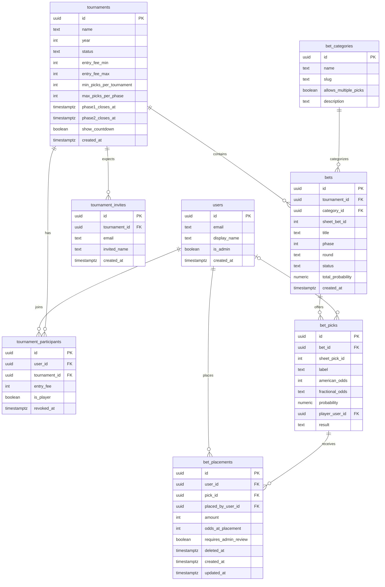

# Data Model

The database schema for the Ozark Open Sportsbook. This is the most important file in the repo — get this right and the rest of the app falls into place. Get it wrong and you'll be rewriting code for years.

---

## 1. Design Principles

1. **The spreadsheet is the source; the schema mirrors it.** Bets, picks, odds, statuses, and results all arrive from the admin's spreadsheet (ADR 0001) and are upserted by its stable IDs. The app never adjudicates a bet — there is no resolution engine to model.
2. **Evergreen identity.** A user has one record forever. Tournaments are separate entities. A user joins a tournament via a join table.
3. **Results attach to picks, not bets or placements.** A pick hits or misses once, globally (`bet_picks.result`). We don't store hit/miss per-placement, and a bet has no outcome of its own — "resolved" is derived from its picks.
4. **Theoretical payout is computed, never stored.** It's a function of `placement.amount`, `placement.odds_at_placement`, and `pick.result`. A Postgres view derives it on demand. (Odds are snapshotted onto the placement at write time — see §3.7 and PRD §7.1.)
5. **Constraints in the right place.** Schema enforces things that are always true (a placement must have positive amount). App code enforces things that are contextual (you can't have more than 10 placements in a phase).

---

## 2. Schema Overview


```mermaid
erDiagram
    users ||--o{ tournament_participants : "joins"
    users ||--o{ bet_placements : "places"
    tournaments ||--o{ tournament_participants : "has"
    tournaments ||--o{ tournament_invites : "expects"
    tournaments ||--o{ bets : "contains"
    bet_categories ||--o{ bets : "categorizes"
    bets ||--o{ bet_picks : "offers"
    bet_picks ||--o{ bet_placements : "receives"
    users |o--o{ bet_picks : "is_player_of"

    users {
        uuid id PK
        text email
        text display_name
        boolean is_admin
        timestamptz created_at
    }

    tournaments {
        uuid id PK
        text name
        int year
        text status
        int entry_fee_min
        int entry_fee_max
        int min_picks_per_tournament
        int max_picks_per_phase
        timestamptz phase1_closes_at
        timestamptz phase2_closes_at
        boolean show_countdown
        timestamptz created_at
    }

    tournament_participants {
        uuid id PK
        uuid user_id FK
        uuid tournament_id FK
        int entry_fee
        boolean is_player
        timestamptz revoked_at
    }

    tournament_invites {
        uuid id PK
        uuid tournament_id FK
        text email
        text invited_name
        timestamptz created_at
    }

    bet_categories {
        uuid id PK
        text name
        text slug
        boolean allows_multiple_picks
        text description
    }

    bets {
        uuid id PK
        uuid tournament_id FK
        uuid category_id FK
        int sheet_bet_id
        text title
        int phase
        text round
        text status
        numeric total_probability
        timestamptz created_at
    }

    bet_picks {
        uuid id PK
        uuid bet_id FK
        int sheet_pick_id
        text label
        int american_odds
        text fractional_odds
        numeric probability
        uuid player_user_id FK
        text result
    }

    bet_placements {
        uuid id PK
        uuid user_id FK
        uuid pick_id FK
        uuid placed_by_user_id FK
        int amount
        int odds_at_placement
        boolean requires_admin_review
        timestamptz deleted_at
        timestamptz created_at
        timestamptz updated_at
    }
```

The two columns easiest to misread from the diagram alone:

- **`tournament_participants.revoked_at`** — eligibility is "a row exists **and**
  `revoked_at IS NULL`" (A13), never bare row-existence. The row is kept when access is
  revoked because it carries the `entry_fee`, which is a pool input. See §3.3.
- **`bet_placements.placed_by_user_id`** — the admin who last wrote the row, not whose wager
  it is. The **bettor** is always `user_id`, and that is what every §7 rule and all pool math
  mean by "whose". See §3.7.

---

## 3. Table Definitions

### 3.1 `users`

One row per person who ever logs in. Persists across tournaments forever.

| Column | Type | Notes |
|---|---|---|
| `id` | `uuid` PK | Matches `auth.users.id` from Supabase Auth |
| `email` | `text` UNIQUE NOT NULL | Used for magic-link login |
| `display_name` | `text` NOT NULL | E.g. "Dan Mercer" — what shows on bets and leaderboards. Set **once by the member** at onboarding (Sprint 16 / A12), then **admin-owned** (Studio / import name-matching, ADR 0001 §11). Defaults to the email until onboarding overwrites it. |
| `nickname` | `text` NULL | Sprint 15 — a user-set *cosmetic* nickname shown next to `display_name` everywhere (a touch smaller, never a muted subtext). Null = none. Does **not** affect import name-matching. |
| `avatar_url` | `text` NULL | Sprint 15 — public URL of the user's uploaded avatar in the `avatars` storage bucket (`<uid>/avatar`, cache-busted). Null → a branded initials placeholder renders. |
| `bio` | `text` NULL | Sprint 18 — short profile blurb shown in the player profile modal. Admin-owned (Studio), pinned in the guard trigger. Dummy-seeded by the migration. |
| `hometown` | `text` NULL | Sprint 18 — "where they're from," shown in the modal header. Admin-owned. |
| `member_since` | `smallint` NULL | Sprint 18 — first year in the Ozark Open; header meta + chart context. Admin-owned. |
| `strength` | `text` NULL | Sprint 18 — one-line scouting strength (modal). Admin-owned. |
| `weakness` | `text` NULL | Sprint 18 — one-line scouting weakness (modal). Admin-owned. |
| `past_performance` | `jsonb` NULL | Sprint 18 — 4-year stats series for the modal chart, a JSON array of `{ "year": int, "value": number }` (oldest→newest). Admin-owned; a null/empty series falls back to a deterministic dummy in `lib/player-profile.ts` so the chart always draws. |
| `is_admin` | `boolean` NOT NULL DEFAULT `false` | Admins are Pat, Jake, Steve, Andrew. Not user-editable (guard trigger). |
| `onboarded_at` | `timestamptz` NULL | Sprint 16 — stamped when the member completes the required first-run step. NULL → the middleware forces `/onboarding`. Also the guard's one-time-set window for `display_name` (see below). Existing members were backfilled as already-onboarded. Admin-created accounts (#124) are stamped at creation, because the admin has already named them. |
| `created_by_user_id` | `uuid` NULL FK → `users.id` | Sprint 23 / #124 — the admin who created this account via `POST /api/admin/members`. NULL = the member registered themselves through the magic link, which is the truth for every row written before the migration (**no backfill**, same reasoning as `placed_by_user_id`). Records the *actor*; never changes whose account it is. |
| `created_at` | `timestamptz` NOT NULL DEFAULT `now()` | |

**Why no `password` column:** there are no passwords. Authentication is magic-link only via Supabase Auth.

**Why no `venmo_handle` column:** the app does not handle payment. Pat keeps Venmo info in his phone, as today.

**Admin-created members (Sprint 23 / #124).** An admin can create an account outright from `/admin/people` — no email, nothing for the member to click — for the people Pat flagged during the Jul 31 dry run as unable to work the magic-link flow. It is half 1 of #101; the wager half (`/bets?for=<userId>`) shipped in Sprint 23 and works for these accounts immediately. `POST /api/admin/members` calls `auth.admin.createUser({ email, email_confirm: true })`, the existing `handle_new_user()` trigger mirrors the new `auth.users` row into `public.users`, and the route then sets `display_name`, `onboarded_at` and `created_by_user_id` **on the admin's own session**, subject to RLS. Approval stays a separate call to `POST /api/admin/participants`, which owns the entry fee (§3.3) — creating an account grants nothing until that row exists (A12/A13). The account is entirely ordinary: if the member later works out the magic link, they sign in to *that* account with their fee, name and wagers intact, so there is no claim or merge path. See §5 for the service-role key this requires and how it's confined, and ADR 0001 §14 for why the alternatives were rejected.

**Admin writes (Sprint 23 / #124).** `"Admins can update any user"` — `USING (public.is_admin())` — added in `20260814000000_admin_manages_users.sql`. It is also a bug fix: until then the *only* `UPDATE` policy was the own-row one below, so the Sprint 23 / #99 display-name edit was a **silent no-op for every user but the acting admin** (RLS filtered the row out, zero rows matched, PostgREST returned success with no error, and the console reported "saved"). The trigger that permits the write exempts admins, but RLS is evaluated **before** the trigger, so no row ever reached it — and every local harness runs SQL as superuser, where RLS is bypassed, so nothing local could have caught it. `display_name` is load-bearing (`lib/import.ts` matches picks to people by it), so this was a rules bug, not a cosmetic one.

**Self-serve edits (Sprint 15, refined Sprint 16).** An own-row `UPDATE` RLS policy (`auth.uid() = id`) lets a member update their own row, and a `BEFORE UPDATE` guard trigger (`guard_users_self_update`) pins `id`/`email`/`is_admin`/`created_at` for any logged-in non-admin. `display_name` + `onboarded_at` are also pinned **once `onboarded_at IS NOT NULL`** — so a member may set their own `display_name` exactly once (their `/onboarding` write, which also stamps `onboarded_at`), after which `/profile` can change only `nickname` + `avatar_url` (A12). The Sprint 18 profile fields (`bio`, `hometown`, `member_since`, `strength`, `weakness`, `past_performance`) are pinned for every self-serve update — admin/Studio-owned like `display_name`, never editable from `/profile` (`20260723000000_player_profiles.sql`). Admins (import name-matching runs under an admin session) and Studio/service writes (`auth.uid()` is null) are unaffected. Avatars live in a public `avatars` storage bucket where a user may write only under their own `<uid>/` prefix (`20260719000000_user_profiles.sql`, `20260719000001_avatars_bucket.sql`, `20260720000000_onboarding_and_bettor_approval.sql`).

---

### 3.2 `tournaments`

One row per Ozark Open year. Holds the rule parameters that govern that year's pool.

| Column | Type | Notes |
|---|---|---|
| `id` | `uuid` PK | |
| `name` | `text` NOT NULL | E.g. "Ozark Open 2026" |
| `year` | `int` NOT NULL UNIQUE | E.g. 2026 |
| `status` | `text` NOT NULL CHECK IN (`'upcoming'`, `'active'`, `'completed'`) | Controls visibility |
| `entry_fee_min` | `int` NOT NULL DEFAULT 20 | Lower bound on entry |
| `entry_fee_max` | `int` NOT NULL DEFAULT 50 | Upper bound on entry |
| `min_picks_per_tournament` | `int` NOT NULL DEFAULT 5 | Fewest wagered picks **across both phases combined**, due by Phase 2 close (PRD §12 A14, Sprint 22 / #96) |
| `max_picks_per_phase` | `int` NOT NULL DEFAULT 10 | Most wagered picks **in any one phase**. Renamed from `max_bets_per_round` (ADR 0001 §10) |
| `max_single_bet_pct` | `numeric(3,2)` NOT NULL DEFAULT 0.50 | Half of entry, by default |
| `max_single_bet_cap` | `int` NOT NULL DEFAULT 20 | Hard cap regardless of entry size |
| `max_self_bet_pct` | `numeric(3,2)` NOT NULL DEFAULT 0.25 | Quarter of entry |
| `max_self_bet_cap` | `int` NOT NULL DEFAULT 10 | Hard cap on self-bets |
| `created_at` | `timestamptz` NOT NULL DEFAULT `now()` | |

**Why store rule parameters per-tournament:** the original memo's rules might evolve. Storing them on the tournament row means the 2026 rules are preserved exactly even if 2027 changes them.

---

### 3.3 `tournament_participants`

Join table connecting users to tournaments. A user is "in" a tournament for a given year if a row exists here.

| Column | Type | Notes |
|---|---|---|
| `id` | `uuid` PK | |
| `user_id` | `uuid` NOT NULL FK → `users.id` | |
| `tournament_id` | `uuid` NOT NULL FK → `tournaments.id` | |
| `entry_fee` | `int` NOT NULL CHECK (`entry_fee BETWEEN 20 AND 50`) | The participant's chosen entry, $20–$50 |
| `is_player` | `boolean` NOT NULL DEFAULT `true` | True if they're playing golf, false if they're only betting (rare) |
| `revoked_at` | `timestamptz` NULL | Non-null = betting access revoked (Sprint 21 / #91). The row and its `entry_fee` are kept so re-approval restores both; see "How access is revoked" below |

**Constraint:** UNIQUE (`user_id`, `tournament_id`) — a user can only join a tournament once. (The `entry_fee` CHECK was relaxed to `> 0` in `20260717000000_bet_pick_rework.sql`; the $20–$50 bounds live on the `tournaments` row and are enforced in app code — DATA_MODEL §6 known inconsistency.)

**Why `is_player`:** the rules talk about "betting on yourself" — that only matters if the bettor is also a player. Non-playing entrants (if any) are exempt from the self-bet rule.

**How rows are created (Sprint 16 / A12).** A member logging in does **not** create a participant row — they're onboarded but not yet in the pool, so they can view the menu but not bet. An admin approves them on `/admin/people` (Sprint 20; was `/admin/participants`), which sets the entry fee + player flag and **creates the row**. A live row = approved to bet; there is no separate `betting_enabled` flag. Writes stay admin-only (RLS): `POST/PATCH/DELETE /api/admin/participants` re-checks `is_admin` and validates the fee against the `tournaments` row. This replaces the old manual Supabase Studio row-add.

**How access is revoked (Sprint 21 / A13, `20260807000000_participant_soft_revoke.sql`).** Revoking stamps `revoked_at` and **keeps the row**, so eligibility is "a row exists **and** `revoked_at IS NULL`" — a refinement of A11/A12's bare row-exists. It used to be a hard `DELETE`, which took the `entry_fee` with it while the bettor's placements (soft-deleted, never removed) survived: the pool silently shrank and every other bettor's share moved. A revoked bettor now leaves **both** sides of the arithmetic together — their fee stops funding the pool, and `buildResultsTable` (`lib/payouts.ts`) drops the payout rows of anyone not in `participants` from the denominator. Nothing is deleted, so re-approval restores the member, the fee and the wagers exactly. Every read that means "approved" filters `revoked_at IS NULL`; `/admin/people` is the one exception — it selects the column so it can show a **Revoked** row and offer re-approval.

People who are *expected* in the tournament but haven't registered are deliberately **not** modeled here — they live in `tournament_invites` (§3.8), precisely so a row in this table keeps meaning "approved to bet".

---

### 3.4 `bet_categories`

The five categories from ADR 0001 §2, stored as configurable data. Since the app never adjudicates (results arrive per pick from the sheet), a category carries only what the app actually uses: display info and the one wagering constraint that differs by category.

| Column | Type | Notes |
|---|---|---|
| `id` | `uuid` PK | |
| `name` | `text` NOT NULL UNIQUE | E.g. "Top X Finisher" — must match the sheet's `category` column |
| `slug` | `text` NOT NULL UNIQUE | E.g. `top_x_finisher` — stable key for code |
| `allows_multiple_picks` | `boolean` NOT NULL | `true` for Top Finisher / Top X Finisher / Prop Bet; `false` for Match / Group Match (one pick per participant, PRD §7 rule 7) |
| `description` | `text` | Human-readable explanation, incl. the informational tie rule (hit/push/manual) |

**Seed data** (re-seeded by the Sprint 1 rework migration): Top Finisher, Top X Finisher, Match, Group Match, Prop Bet.

**Why no `resolution_type`:** resolution math lives in the admin's Excel workbook (helper columns); the app ingests each pick's result and never computes one. Tie behavior is documented in `description` for humans, not consumed by code.

**Adding a sixth category later:** insert a row here and use its name in the sheet. If it needs a new wagering constraint beyond `allows_multiple_picks`, that's a code change — by design.

---

### 3.5 `bets`

The bet menu headings. One row per bet in the admin's spreadsheet, upserted by the sheet's `bet_id` (ADR 0001 §7).

| Column | Type | Notes |
|---|---|---|
| `id` | `uuid` PK | |
| `tournament_id` | `uuid` NOT NULL FK → `tournaments.id` | |
| `category_id` | `uuid` NOT NULL FK → `bet_categories.id` | Matched from the sheet's `category` column |
| `sheet_bet_id` | `int` NOT NULL | The sheet's `bet_id` — the stable upsert key. Not displayed. |
| `title` | `text` NOT NULL | The sheet's `bet` column, e.g. "Win Tournament". Not necessarily unique. |
| `phase` | `int` NOT NULL CHECK IN (1, 2) | Which betting window the bet belongs to |
| `round` | `text` NOT NULL CHECK IN (`'tournament'`, `'round_1'`, `'round_2'`, `'round_3'`) | Golf scope. `round_2` is allowed by schema but unused by policy — no Round 2 bets are released. |
| `status` | `text` NOT NULL CHECK IN (`'hidden'`, `'open'`, `'closed'`) DEFAULT `'hidden'` | `hidden` = placeholder, app ignores (the old "draft") |
| `total_probability` | `numeric` | Sum of pick probabilities, as calculated in the sheet. Displayed verbatim, informationally. |
| `created_at` | `timestamptz` NOT NULL DEFAULT `now()` | |

**Constraint:** UNIQUE (`tournament_id`, `sheet_bet_id`) — the upsert key.

**Why no `american_odds` / `outcome` here:** odds and results are per-**pick** now (§3.6). A bet has no outcome of its own; "resolved" is derived (bet `closed` + pick results non-pending). No stored resolved status means uploads can't desynchronize two representations — the fat-finger class the old `resolved ⇔ outcome` CHECK guarded against no longer exists.

---

### 3.6 `bet_picks`

The options within a bet — one row per pick in the spreadsheet, upserted by the sheet's `pick_id`. **This is what participants wager on.**

| Column | Type | Notes |
|---|---|---|
| `id` | `uuid` PK | |
| `bet_id` | `uuid` NOT NULL FK → `bets.id` ON DELETE CASCADE | |
| `sheet_pick_id` | `int` NOT NULL | The sheet's `pick_id` — the stable upsert key. Not displayed. |
| `label` | `text` NOT NULL | The sheet's `pick` column, incl. stroke notation: "Steve Jones (-5)", "Field", "Yes" |
| `american_odds` | `int` NOT NULL | E.g. `+400`, `-130`. Zero invalid. **Source of truth for payout math** (snapshotted at placement, PRD §7.1). |
| `fractional_odds` | `text` NOT NULL | As formatted in the sheet (e.g. "4/1"). Displayed verbatim — never recomputed. |
| `probability` | `numeric` NOT NULL | Implied probability as calculated in the sheet. Displayed verbatim to 1 decimal place. |
| `player_user_id` | `uuid` FK → `users.id` | The player this pick refers to, name-matched at import (stroke suffixes stripped). NULL for "Field", "Yes"/"No", and unmatched names (surfaced in the import report). Drives self-pick flagging and the opponent hard-block (PRD §7 rules 7–8). |
| `result` | `text` NOT NULL CHECK IN (`'pending'`, `'hit'`, `'miss'`, `'push'`, `'void'`) DEFAULT `'pending'` | From the sheet's `result` column. Displayed only when not `pending`. |

**Constraint:** UNIQUE (`bet_id`, `sheet_pick_id`). The sheet's `pick_id` is unique across the whole sheet; the importer verifies that before writing (the table can't express cross-bet uniqueness without denormalizing `tournament_id` — not worth it).

**Replaces `bet_subjects`** (dropped in the Sprint 1 rework migration): instead of a bet-level list of subject players, each pick links to its player. Self-pick = placing on a pick whose `player_user_id` is you. Opponent = you are a `player_user_id` of some pick in a Match/Group Match bet, and you place on a *different* pick of that bet.

---

### 3.7 `bet_placements`

Each individual wager: one row per (user, pick) pair where money was placed.

| Column | Type | Notes |
|---|---|---|
| `id` | `uuid` PK | |
| `user_id` | `uuid` NOT NULL FK → `users.id` | The bettor |
| `pick_id` | `uuid` NOT NULL FK → `bet_picks.id` | The pick being wagered on |
| `amount` | `int` NOT NULL CHECK (`amount > 0`) | Whole dollars, $1 minimum |
| `odds_at_placement` | `int` NOT NULL | Snapshot of `bet_picks.american_odds` at write time. **Payouts compute from this, never from the live pick row** — a re-uploaded reprice can't silently change existing bettors' payouts (PRD §7.1). |
| `requires_admin_review` | `boolean` NOT NULL DEFAULT `false` | Set on write when the pick's `player_user_id` is the bettor (self-pick flag, PRD §7). |
| `placed_by_user_id` | `uuid` NULL FK → `users.id` | Sprint 23 / #101 — the admin who **last wrote this row on the bettor's behalf**. NULL = the bettor placed it themselves, which is the truth for every row written before Sprint 23 (no backfill). The bettor is always `user_id`; this column never changes whose wager it is. Stamped on inserts, edits and the soft delete alike, so it answers "who last touched this row". |
| `deleted_at` | `timestamptz` | Soft delete — removing a placement sets this instead of deleting the row. Money data keeps its history for dispute resolution. All reads filter `deleted_at IS NULL`. |
| `created_at` | `timestamptz` NOT NULL DEFAULT `now()` | |
| `updated_at` | `timestamptz` NOT NULL DEFAULT `now()` | Updated on edit |

**Constraint:** UNIQUE (`user_id`, `pick_id`) — one placement per pick per user. (Editing updates `amount` rather than creating a second row. Re-placing after a soft delete revives the existing row — clears `deleted_at`, updates `amount`, re-snapshots `odds_at_placement` — so the unique constraint holds.) Multiple placements across different picks of the same bet are allowed in the multi-pick categories, and blocked in app code for Match / Group Match.

**Betting on someone's behalf (Sprint 23 / #101, ADR 0001 §13).** An admin can enter a wager for a member who can't work the magic-link flow, from `/bets?for=<userId>` via `POST/PATCH/DELETE /api/admin/placements`. Two properties hold it together. First, **every PRD §7 rule evaluates against the bettor** — `lib/placement-write.ts` takes `{ bettor_id, actor_id }`, and both routes run that one path, so the entry fee, the running total, the self-bet cap, the opponent block and `requires_admin_review` can never silently key off the acting admin. Second, the member's own "only as yourself" policies were **not loosened**: a separate admin-scoped INSERT/UPDATE pair carries `public.is_admin() AND placed_by_user_id = auth.uid()`, so Postgres itself refuses a forged attribution. Eligibility, the bet's `open` status and the phase deadline all still bind — acting for someone is not permission to break the tournament's rules.

**Constraints NOT enforced at the schema level** (these live in app code because they require cross-row checks; semantics per PRD §7/§12/ADR 0001):
- Between 5 and 10 pick-placements per user in any phase they bet in — each wagered pick counts individually.
- Sum of placements **across both phases** ≤ entry fee; must equal it exactly by Phase 2 close ("$40 across the board" — the entry fee funds the whole tournament, not each phase).
- Single placement amount ≤ `min(max_single_bet_pct × entry_fee, max_single_bet_cap)` — per placement, either phase.
- Sum of self-pick placements **across the tournament** ≤ `min(max_self_bet_pct × entry_fee, max_self_bet_cap)`.
- One pick per Match / Group Match bet (`bet_categories.allows_multiple_picks = false`).
- No placement on an opponent's pick in a Match / Group Match the bettor plays in — hard reject.

---

### 3.8 `tournament_invites`

The **expected roster** — who we think is playing this year. Entered before anyone signs in, and read by `/admin/people` (Sprint 20; originally `/admin/roster`, Sprint 10).

| Column | Type | Notes |
|---|---|---|
| `id` | `uuid` PK | |
| `tournament_id` | `uuid` NOT NULL FK → `tournaments.id` | |
| `email` | `text` NOT NULL CHECK (`position('@' IN email) > 1`) | Stored as typed; matched case-insensitively |
| `invited_name` | `text` | Optional — so the "hasn't registered yet" chase list reads as names, not raw addresses |
| `created_at` | `timestamptz` NOT NULL DEFAULT `now()` | |

**Constraint:** UNIQUE (`tournament_id`, `lower(email)`) — a functional index, so hand-typed `Dan@X.com` and `dan@x.com` collide instead of producing two roster rows.

**Why a separate table rather than a nullable `tournament_participants.user_id`.** Sprint 10 originally proposed widening §3.3 to hold "invited but never registered". That would break the A11 invariant above: a live `tournament_participants` row (one with `revoked_at IS NULL` — A13) *means* approved to bet, and it's what `/dashboard`, `/results` and `/admin/view` sum the pool from. Invite rows there would either inflate the pool or force a `user_id IS NOT NULL` guard into every tournament-wide query. Keeping them apart costs one table and protects the money math.

**No FK to `users`** — by design. The whole point of an invite is that the `users` row may not exist yet, so `/admin/people` matches the two by normalized email at read time (`lib/roster.ts`).

**Written by the app since Sprint 20.** The console's paste box (`POST /api/admin/invites`) parses `name, email` lines and adds the missing ones, keyed on the same normalized email as the unique index above — so re-pasting the same list is a no-op. It only ever inserts, or fills in a name that changed; removing an invite is still a Studio job.

---

## 4. The Payout View

A read-only Postgres view that computes each placement's theoretical payout. Defined in a migration; queryable like a table.

```sql
CREATE VIEW placement_payouts_view
WITH (security_invoker = on) AS  -- honor the caller's RLS; a default
                                 -- (definer) view would leak open-phase
                                 -- placements to non-admins
SELECT
    p.id                 AS placement_id,
    p.user_id,
    pk.id                AS pick_id,
    pk.bet_id,
    p.amount,
    pk.result,
    p.odds_at_placement,
    b.tournament_id,
    CASE
        WHEN pk.result = 'hit' AND p.odds_at_placement > 0
            THEN p.amount + (p.amount * p.odds_at_placement / 100.0)
        WHEN pk.result = 'hit' AND p.odds_at_placement < 0
            THEN p.amount + (p.amount * 100.0 / ABS(p.odds_at_placement))
        WHEN pk.result = 'push'
            THEN p.amount
        WHEN pk.result IN ('miss', 'void')
            THEN 0
        WHEN pk.result = 'pending'
            THEN NULL  -- not yet resolved
    END AS theoretical_payout,
    CASE
        WHEN pk.result = 'void' THEN p.amount
        ELSE 0
    END AS refunded_stake
FROM bet_placements p
JOIN bet_picks pk ON pk.id = p.pick_id
JOIN bets b       ON b.id  = pk.bet_id
WHERE p.deleted_at IS NULL;
```

Notes:

- Computes from `p.odds_at_placement` (the snapshot taken when the wager was written, PRD §7.1) — never from `pk.american_odds`, which a re-upload may have repriced since — and excludes soft-deleted placements.
- **Void ≠ push** (ADR 0001 §9): a push credits the stake as theoretical payout; a void contributes 0 to the theoretical total and instead surfaces the stake in `refunded_stake`, so the pool can shrink.

The actual-payout proportional split runs in TypeScript at render time (`lib/payouts.ts`), since it requires summing across all users (one query, then arithmetic):

```
pool_total   = sum(entry fees) − sum(refunded_stake)
actual(user) = theoretical(user) / sum(theoretical(all)) × pool_total
```

---

## 5. Row-Level Security Highlights

Policies live inline in each table's migration file under `supabase/migrations/` (e.g., `20260507000000_users_table.sql`, `20260507000001_tournaments.sql`, `20260507000002_bets.sql`). Summary:

- **`bets`**: anyone authenticated can `SELECT` rows where `status != 'hidden'`. Only admins can `INSERT` / `UPDATE` / `DELETE` (in practice: the import route, running as the admin).
- **`bet_picks`**: readable whenever the parent bet is readable (not `hidden`). Write: admins only (the import route).
- **`bet_placements`**: a user can `SELECT` / `INSERT` / `UPDATE` / soft-delete their own rows while the parent bet is `open`. Other users' placements are visible only when the bet is `closed`. Admins can read all, and (Sprint 23 / #101) can `INSERT` / `UPDATE` rows for **another** bettor through a separate admin-scoped pair that requires `public.is_admin() AND placed_by_user_id = auth.uid()` — the member's own-rows policies are unchanged, and the attribution clause means the database refuses an admin who claims someone else entered the wager. No `DELETE` policy for anyone, admins included.
- **`tournament_participants`**: anyone authenticated can `SELECT`. Only admins can `INSERT` / `UPDATE`.
- **`bet_categories`, `tournaments`**: read by all authenticated users; write by admins only.
- **`users`**: readable by all authenticated users (`20260717000002_users_read_all.sql` — closed-bet views and payouts show everyone's `display_name`, PRD §12 Q12; fine for a private pool behind login). Writes: an own-row `UPDATE` for members (narrowed by the guard trigger) plus `"Admins can update any user"` (`20260814000000`, Sprint 23 / #124) — the latter is what makes the #99 display-name edit actually land; before it, admin name corrections were a silent no-op (see §3.1).
- **`tournament_invites`**: admins only, read *and* write — unlike `users`, these are the email addresses of people who aren't in the app yet, and the admin people console is the only consumer.
- **`admin_auth_activity()`** (`20260725000000`): not a table but the same boundary. `auth.users.last_sign_in_at` isn't client-readable, so this `SECURITY DEFINER` function exposes just `(user_id, last_sign_in_at)` and self-gates on `is_admin()` — a non-admin caller gets zero rows, not an error. `EXECUTE` is revoked from `anon` and granted to `authenticated` only. This is deliberately *not* a service-role client: one full-bypass key in the runtime to read one timestamp column isn't a trade worth making. **That trade is still not worth making here** — but see the exception immediately below, which is why this paragraph no longer says the app has no such key at all.

### 5.1 The one service-role key, and why it's confined

**Amended Aug 9, 2026 (Sprint 23 / #124).** This section used to say flatly that the app holds no service-role key. It now holds exactly one, and pretending otherwise would be the drift `CLAUDE.md` tells us to flag.

**Why it exists.** `public.users.id REFERENCES auth.users(id)`, so an account cannot exist without a GoTrue row, and nothing the anon key can do creates one. Pat asked during the Jul 31 dry run to add members himself for the people who won't get through magic-link. There is no anon-key path to that, and the three alternatives were each worse (ADR 0001 §14): a `SECURITY DEFINER` function hand-writing `auth.users` + `auth.identities` is GoTrue's internal schema, unverifiable locally and breakable by an auth upgrade; shadow users with the FK dropped leave the member unable to ever claim their own account; an admin-triggered invite is still an email round-trip, so it doesn't solve the problem.

**What it costs.** A `SUPABASE_SERVICE_ROLE_KEY` in the Vercel runtime bypasses RLS *entirely* — every policy on this page is inert against it. If that environment leaks, it is the whole database. The reasoning above (and Sprint 11's choice of pg_cron over Vercel Cron, made specifically to avoid this key) was correct and is not retracted; it is overridden once, for the one feature that cannot be built without it.

**How it's confined** — four properties, not one, because the real risk is the *second* use by someone who finds the key already present:

1. `lib/supabase/admin.ts` carries `import "server-only"`, so importing it from a Client Component is a **build** error.
2. Exactly **one** importer — `app/api/admin/members/route.ts` — asserted by `lib/admin-client-containment.test.ts`, not merely documented.
3. That route uses it for **one call**: creating the auth account. The `public.users` write and the participant row both run on the admin's own session and stay subject to RLS, so RLS remains the real boundary rather than something bypassed for convenience.
4. The key is never `NEXT_PUBLIC_*`, never used in middleware, and never used to read.

**If the env var is unset**, the route answers 503 with a legible message and nothing else in the app is affected — the feature is inert, not broken.

---

## 6. Migration Strategy

- All schema changes are SQL files in `supabase/migrations/`, named with timestamps (`20260507000000_users_table.sql`).
- Apply locally with `npx supabase db push` or by pasting into the Supabase SQL Editor.
- Never edit the schema directly in Supabase Studio — only the data. Schema changes go through migration files so the production and local environments stay in sync.

**Migrations shipped so far** (one per phase, each with its tables + RLS + seeds):
- `20260507000000_users_table.sql` — `users`, `is_admin()` helper, new-user trigger
- `20260507000001_tournaments.sql` — `tournaments`, `tournament_participants`, 2026 seed
- `20260507000002_bets.sql` — `bet_categories`, `bets`, `bet_subjects`, seven-category seed *(pre-ADR-0001 shape — superseded by the rework below)*
- `20260717000000_bet_pick_rework.sql` — Sprint 1: `bets` rebuilt to the §3.5 shape, `bet_picks`, `bet_subjects` dropped, five-category re-seed, per-phase rule params renamed
- `20260717000001_bet_placements.sql` — Sprint 3: `bet_placements` with soft delete, odds snapshot, and the open/closed visibility policies
- `20260717000002_users_read_all.sql` — Sprint 6: authenticated read-all policy on `users` (names on closed bets)
- `20260718000000_placement_payouts_view.sql` — Sprint 7: the §4 payout view with `security_invoker` (SQL proven on a throwaway local PG16 by `scripts/payout-view-roundtrip.ts`)
- `20260719000000_user_profiles.sql` — Sprint 15: `users.nickname` / `users.avatar_url`, the self-update policy and its guard trigger
- `20260719000001_avatars_bucket.sql` — Sprint 15: the public `avatars` storage bucket
- `20260720000000_onboarding_and_bettor_approval.sql` — Sprint 16: `users.onboarded_at`, relaxed self-update guard (A11 "approval creates the row" stands)
- `20260723000000_player_profiles.sql` — Sprint 18: the admin-owned profile columns behind the player modal
- `20260725000000_tournament_invites.sql` — Sprint 10: `tournament_invites` (§3.8) + the `admin_auth_activity()` definer function
- `20260807000000_participant_soft_revoke.sql` — Sprint 21: `tournament_participants.revoked_at` (A13)
- `20260808000000_tournament_wide_pick_minimum.sql` — Sprint 22: `tournaments.min_picks_per_tournament` (A14)
- `20260810000000_phase_clock.sql` — Sprint 25: the per-phase deadlines + `show_countdown` (ADR 0001 §5a)
- `20260811000000_admin_placed_wagers.sql` — Sprint 23: `bet_placements.placed_by_user_id` + the admin-scoped placement policies (ADR 0001 §13)

**Still to come** (see `ROADMAP.md`): nothing scheduled.

**Known inconsistency to fix in the rework migration:** `tournament_participants.entry_fee` currently has a hardcoded `CHECK (entry_fee BETWEEN 20 AND 50)`, but the entry-fee bounds are supposed to live on the `tournaments` row (`entry_fee_min` / `entry_fee_max`) per the "rules are data, not constants" convention. Fix: drop the hardcoded CHECK (keep `entry_fee > 0`) and enforce the per-tournament bounds in `lib/validation.ts` / at participant creation instead.
